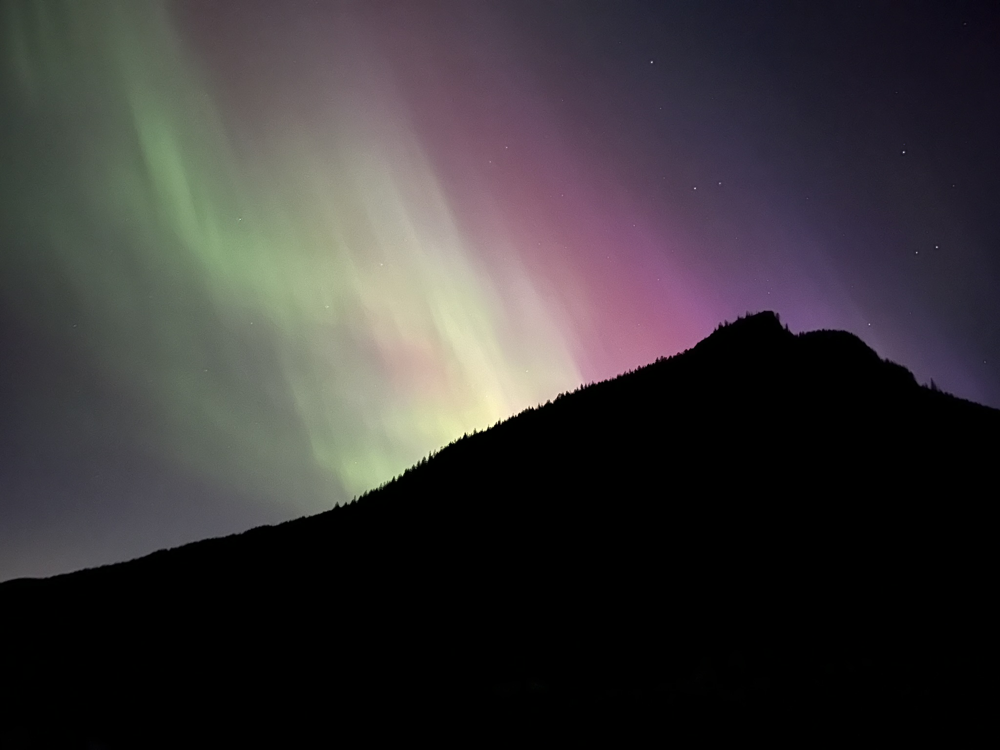
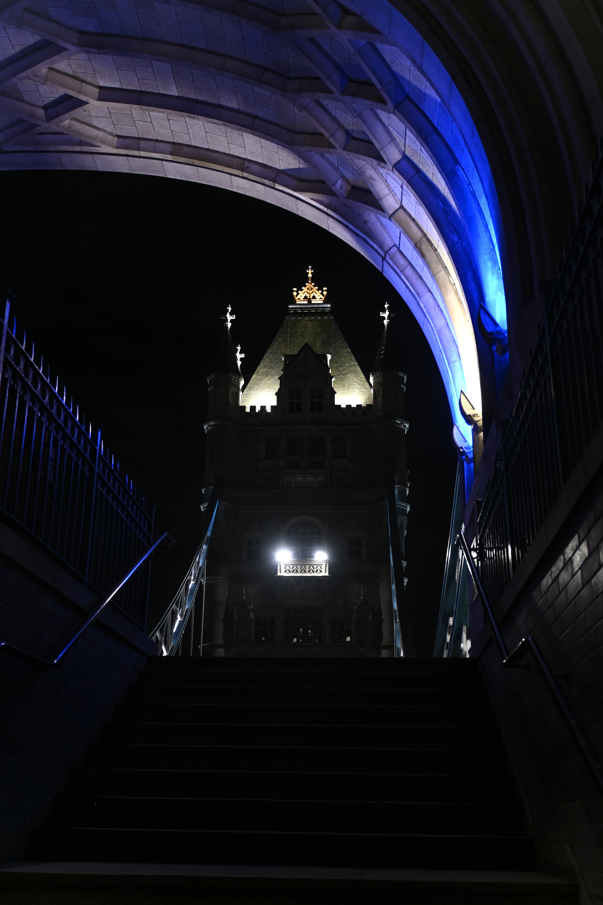

<section class="hero">
  
  

    <h1>Made and Remembered</h1>
    
Seeing, creating, and inspirations

    <a href="#portfolio" class="cta-button">View My Work</a>
  

</section>

<section id="about">
  <h2>About Me</h2>
  
Hi there, and thanks for stopping by.  Over the years, this space has taken many different forms, but I’m excited to finally have something that feels right; a place to share what I enjoy, without any grand artistic mission or deep philosophical undertones.  Just me, the things that make me happy, and a way to remember and share them with others.

One of the big drivers behind this site was stepping away from social media, at least from the feeling of cyclical forced interactions with pre-determined content.  While I appreciate the connections it makes possible, I think there’s a better way; something more personal, more intentional.  This space is my way of keeping the best parts while leaving behind the noise.

I’ve been incredibly fortunate to have blended so much travel with unforgettable memories, and meeting some truly wonderful people.  This is a little corner of the internet where I can collect those experiences, tell some stories, and hopefully connect with others in a way that feels meaningful.  Looking forward to expanding this over time; we'll see where it goes!  

- Will

</section>

<section id="portfolio">
  <h2>My Portfolio</h2>
  

    
    
    
  

</section>
